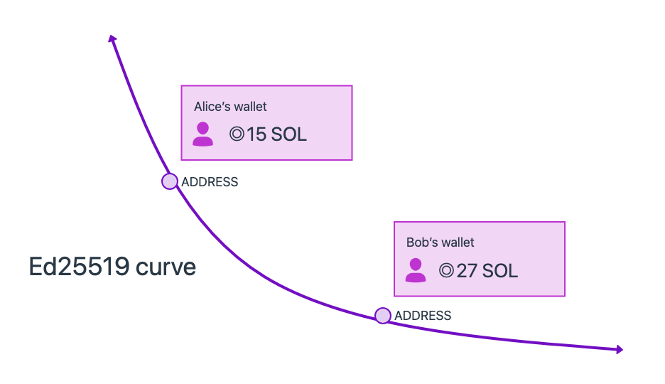
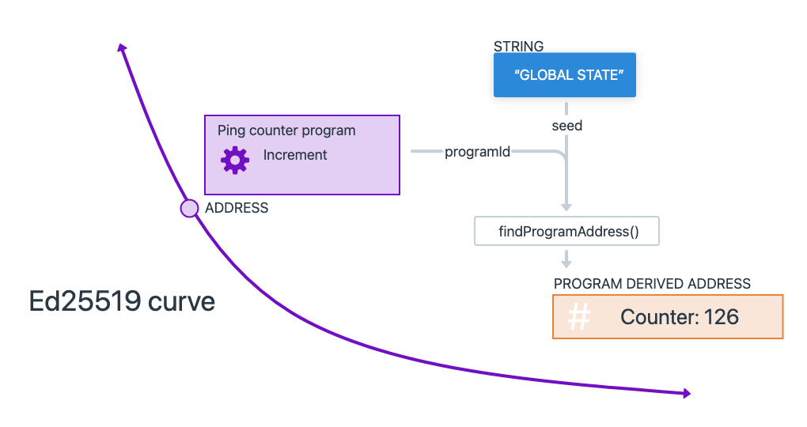
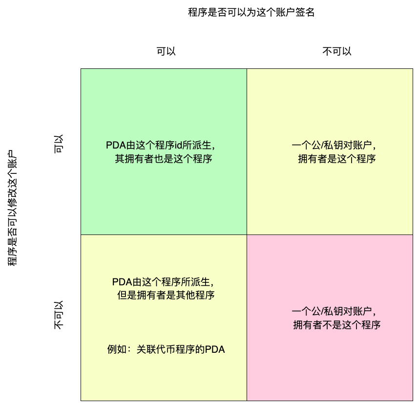

# solana-st

## 1. Install solana python sdk / js sdk / cargo sdk
```bash
npm install --save @solana/web3.js
pip3 install solders
pip3 install solana
cargo add solana-program
```

## 2. solana account model


## 3. solana account info 


## 4. program account and data account 


## 5. delete a data account program
[delete-account program](delete-account)

## 6. Serialization scheme
1. packet
2. bincode
3. borsh

## 7. BPF--Berbeley-Packet-Filter
BPF 一种虚拟字节码，需要运行在虚拟机上
rust 编译BPF字节码
```bash
cargo build-bpf
```

solana 部署BPF字节码
```bash
 solana program deploy ./hello_world/target/deploy/hello_world.so 
```
solana 关闭程序账户
```bash
solana program close DsF7XpSZZv4hqcFqHpVowf6UPPkdjvDmhdFtDzifE9qp --bypass-warning
```

## 8. PDA--(program-dervie-account)



1. PDA 账户是公开透明的
2. PDA 账户是被找出来的，通过程序id/自己拥有地址 + bump(0~255) + 可选的(seed)
3. PDA 账户的创造者可以对PDA账户进行签名
4. PDA 账户的拥有者可以对账户数据进行修改
5. PDA 调用合约，使用invoke_signed(),普通账户调用使用invoke()


## 9. 一些最初期的尝试，包含错误


## 10. POH

## 11. CPI (cross-program-interface)
1. 4个深度( A调用B-> C -> D)
2. 基于PDA


## 12. bytesTobase58
[keypair](bytesTobase58.py)

## 13. createmanyaccount
[create_wallet](create_wallet.py)

## 14. rent
1. There is a rent fee to create a new account
2. If the sol address balance meets the rent fee for 2 years, it will be free
3. The rent fee is charged at the end of the epoch, which takes about 2 days per epoch. Or when this address initiates a transaction on the chain.
4. If the sol is insufficient to pay the rent fee, the account will be deleted.
5. data > 0, each byte will be charged a rent fee, which is about 10M for ordinary accounts and about 10K for program accounts.

## 15. account with seed
通过seed，可以用同一个密钥建立多个不同的地址

## 16. nonce account
1. 离线交易和签名
2. 并发交易

## 17. stake account
1. 委托


